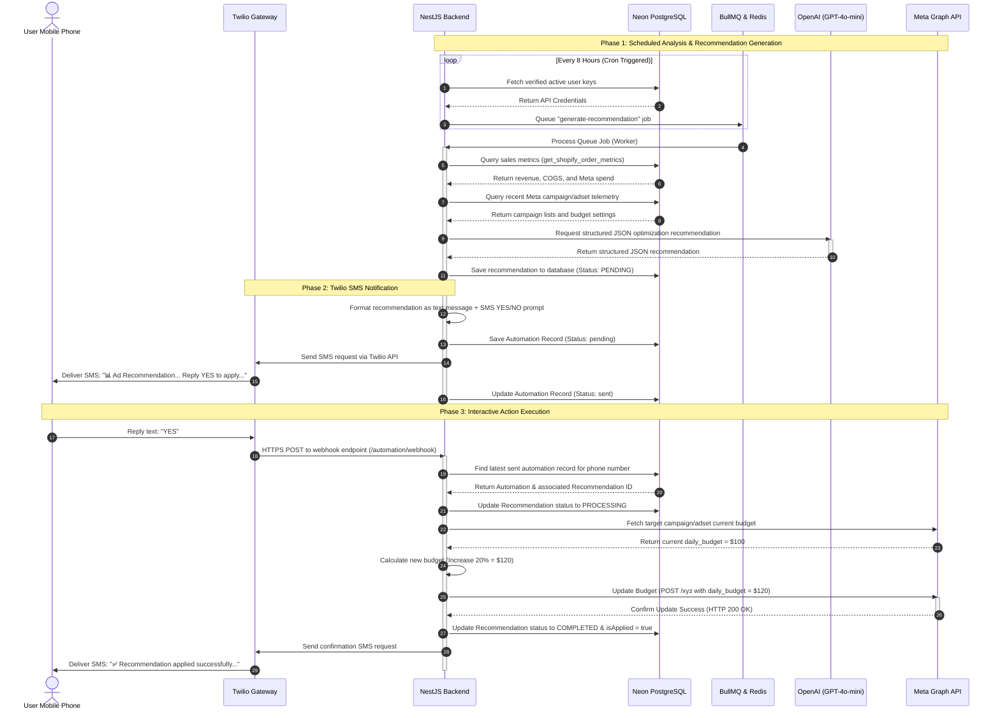
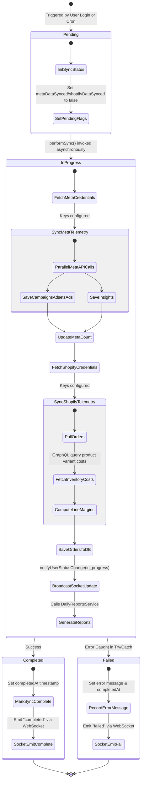

# Thoth AI
## 1. Executive System Overview

The **Thoth AI Platform** is a multi-tenant, premium e-commerce and marketing optimization system. It connects directly with online stores (via Shopify) and advertising accounts (via Meta) to pull raw insights and ad telemetry. It analyzes this data with a custom analytics layer, processes high-dimensional metrics at the database level using PostgreSQL stored procedures, and triggers automated AI recommendations to dynamically adjust marketing spend and maximize return on ad spend (ROAS).

### Technology Stack & Services
* **Backend Framework:** NestJS (TypeScript) utilizing custom modules, guards, interceptors, and exception filters.
* **Database & Persistence:** Neon DB / PostgreSQL managed via TypeORM, implementing custom SQL procedures for fast multi-dimensional financial calculations.
* **Background Processing:** BullMQ (powered by Redis) for high-performance, asynchronous recommendation worker queues.
* **Task Scheduling:** NestJS `ScheduleModule` hosting hourly, bi-hourly, and daily cron jobs.
* **Authentication:** JWT (JSON Web Tokens), Passport.js strategies, and bcryptjs passwords.
* **External Integrations:**
  * **Shopify API:** Rest API for orders and GraphQL API for product variant inventory costs.
  * **Meta Graph API:** Ad account details, campaigns, adsets, ads, and ad-level performance metrics.
  * **OpenAI API:** GPT-based LLM recommendations utilizing structured JSON outputs.
  * **Twilio API:** Interactive SMS message processing and two-way webhook loops.
  * **Stripe API:** Checkout sessions and event-based payment status processing.

---

## 2. Core Architectural Flow

```mermaid
graph TD
    %% Styling Classes
    classDef client fill:#e0f7fa,stroke:#00acc1,stroke-width:2px,color:#01579b;
    classDef gate fill:#efebe9,stroke:#8d6e63,stroke-width:2px,color:#3e2723;
    classDef db fill:#e8f5e9,stroke:#4caf50,stroke-width:2px,color:#1b5e20;
    classDef ext fill:#fff3e0,stroke:#ff9800,stroke-width:2px,color:#e65100;
    classDef queue fill:#f3e5f5,stroke:#9c27b0,stroke-width:2px,color:#4a148c;

    %% Elements
    Client["User Dashboard / CLI"]:::client
    TwilioClient["User Mobile Phone"]:::client
    
    subgraph NestJsGateway ["NestJS API Gateway"]
        direction TB
        AuthCtrl["Auth Controller"]:::gate
        UserCtrl["Users Controller"]:::gate
        KeyCtrl["Keys Controller"]:::gate
        SyncCtrl["Sync Controller"]:::gate
        SubCtrl["Subscription Controller"]:::gate
        AutoCtrl["Automation Controller"]:::gate
        
        AuthServ["Auth Service"]:::gate
        UserServ["Users Service"]:::gate
        KeyServ["Keys Service"]:::gate
        SyncServ["Sync Service"]:::gate
        SubServ["Subscription Service"]:::gate
        AutoServ["Automation Service"]:::gate
    end
    
    subgraph JobsEngine ["Cron & Asynchronous Engine"]
        direction TB
        CronServ["Cron Service"]:::queue
        BullQueue["BullMQ: recommendation-queue"]:::queue
        Processor["Recommendation Processor"]:::queue
    end

    subgraph Storage ["Neon PostgreSQL & Cache"]
        direction TB
        Postgres["PostgreSQL DB"]:::db
        StoredProcs["PL/pgSQL Functions<br/>get_shopify_order_metrics<br/>get_shopify_order_metrics_daily<br/>get_shopify_order_metrics_last_24hrs"]:::db
        Redis["Redis Cache"]:::db
    end

    subgraph ExternalAPIs ["External Platforms & APIs"]
        direction TB
        ShopifyAPI["Shopify API<br/>REST & GraphQL"]:::ext
        MetaAPI["Meta Graph API<br/>v23.0"]:::ext
        OpenAI["OpenAI API<br/>gpt-4o-mini"]:::ext
        TwilioAPI["Twilio SMS Gateway"]:::ext
        StripeAPI["Stripe Gateway"]:::ext
    end

    %% Gateway Routing & Services
    Client -->|HTTPS or WSS| NestJsGateway
    AuthCtrl --> AuthServ
    UserCtrl --> UserServ
    KeyCtrl --> KeyServ
    SyncCtrl --> SyncServ
    SubCtrl --> SubServ
    AutoCtrl --> AutoServ

    %% Db interactions
    AuthServ -->|TypeORM| Postgres
    UserServ -->|TypeORM| Postgres
    KeyServ -->|TypeORM| Postgres
    SubServ -->|TypeORM| Postgres
    AutoServ -->|TypeORM| Postgres
    Redis -->|Cache Store| BullQueue
    BullQueue -->|Queue State| Redis
    
    %% Database aggregates
    SyncServ -->|Calls SQL functions| StoredProcs
    StoredProcs -->|Aggregates| Postgres

    %% Key Verification & Sync Lines
    KeyServ -->|Validate Tokens| ShopifyAPI
    KeyServ -->|Validate Tokens| MetaAPI
    SyncServ -->|Fetch Telemetry| ShopifyAPI
    SyncServ -->|Fetch Telemetry| MetaAPI
    ShopifyAPI -->|Save Orders and Variants| Postgres
    MetaAPI -->|Save Adset and Campaign metrics| Postgres
    
    %% Background Scheduler Lifecycle
    CronServ -->|Hourly Cron| SyncServ
    CronServ -->|Scheduled Queue Job| BullQueue
    BullQueue --> Processor
    Processor -->|Generates Context| CronServ
    CronServ -->|Builds Prompts| OpenAI
    OpenAI -->|Returns JSON Recommendation| CronServ
    
    %% Automation & SMS Webhook loop
    CronServ -->|Save Rec & Queue SMS| AutoServ
    AutoServ -->|Send SMS recommendation| TwilioAPI
    TwilioAPI -->|Delivers Text Message| TwilioClient
    TwilioClient -->|Replies YES or NO| TwilioAPI
    TwilioAPI -->|Webhook HTTPS POST| AutoCtrl
    AutoCtrl -->|Invokes action| AutoServ
    AutoServ -->|Pauses or Updates Budget| MetaAPI
    AutoServ -->|Confirms Action via SMS| TwilioAPI
    
    %% Payment integrations
    SubServ -->|Initializes Card Checkout| StripeAPI
    StripeAPI -->|Webhook checkout.completed| SubCtrl
```

---

## 3. Core Component Analysis

### A. Authentication & Onboarding
### B. Integration Keys Management
### C. The Asynchronous Data Sync Pipeline
### D. Advanced Metric Aggregations (PL/pgSQL Functions)
---

## 4. Sequence Diagram: SMS Budget Optimization Loop

The signature feature of Thoth AI is its interactive budget optimization loop. It provides an automated, secure path to optimization, allowing users to apply complex marketing adjustments with a simple text reply:

---

## 5. Sync State Machine

The following diagram tracks the lifecycle states of the data synchronization process:

---

## 6. System Design Verification & Best Practices

1. **Security Isolation:** API keys and sensitive tokens (Shopify Token, Meta Token) are encrypted or stored under strict access guidelines in Neon DB. Custom authentication strategies utilize standard passport JWT guards, verifying signatures and checking JWT payloads (`sub`, `role`) dynamically.
2. **Resilience & Fault Tolerance:** Database synchronization functions utilize `try/catch` boundaries around each platform fetch call. If Shopify sync fails, Meta sync continues to run, updating flags gracefully to avoid breaking the background queue execution.
3. **Optimized DB Operations:** E-commerce telemetry represents highly fragmented transactional records. Instead of pulling millions of rows to NestJS to perform analysis, Neon DB's SQL analytical functions process high-volume sums, COGS margin aggregations, customer repeats, and channel splits in milliseconds inside PostgreSQL itself.
4. **BullMQ Backgrounding:** AI prompt assembly and LLM response parsing are slow, resource-heavy operations that can take several seconds. Offloading these tasks to BullMQ workers preserves NestJS API request handlers, guaranteeing that web controllers remain highly responsive to frontend calls.
5. **Interactive Edge Loops:** The integration of Twilio's incoming webhooks to dynamically update live production ad campaign budgets on Meta represents a highly decoupled, state-driven telemetry loop, offering friction-free operations to e-commerce administrators.
